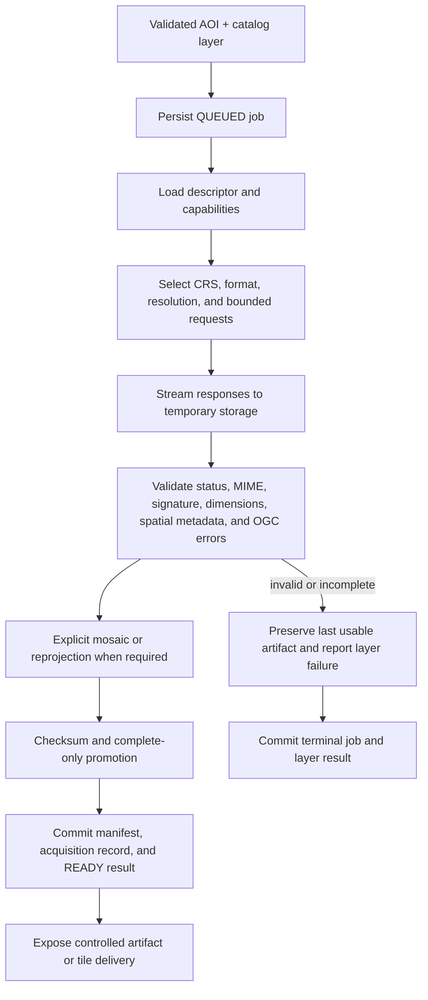

# Acquisition And Artifact Flow

## Status And Scope

This document defines the accepted target runtime flow for resolving project
areas, acquiring allowlisted source evidence, validating responses, and
promoting immutable artifacts. The replacement backend does not implement this
flow yet. Exact provider evidence remains in `docs/research/**`; user-visible
behavior and budgets remain in
[ACQUIRE-001](../requirements/layer-acquisition.md).

## Responsibilities

```mermaid
flowchart LR
    COMMAND["Validated AOI and selected catalog IDs"]
    ORCHESTRATOR["Acquisition orchestrator"]
    DESCRIPTOR["Server-owned source descriptor"]
    ADAPTER["Protocol/provider adapter"]
    PROVIDER["Allowlisted public provider"]
    TEMP["Bounded temporary storage"]
    VALIDATOR["Response and spatial validator"]
    ARTIFACT["ArtifactStore promotion"]
    STATE["RuntimeStateStore jobs + manifests"]
    CLIENT["Progress and per-layer result"]

    COMMAND --> ORCHESTRATOR
    DESCRIPTOR --> ORCHESTRATOR
    ORCHESTRATOR --> ADAPTER
    ADAPTER --> PROVIDER
    PROVIDER -->|"stream"| TEMP
    TEMP --> VALIDATOR
    VALIDATOR -->|"complete result"| ARTIFACT
    ORCHESTRATOR -->|"job transitions + outcomes"| STATE
    ARTIFACT -->|"ready manifest"| STATE
    ORCHESTRATOR --> CLIENT
    STATE --> CLIENT
```

The orchestrator owns job state, cancellation, budgets, retries, and per-layer
results. Adapters own protocol-specific capabilities, request construction,
axis order, parsing, and error recognition. `ArtifactStore` owns byte storage
semantics; `RuntimeStateStore` owns authoritative manifests and job records.

## Source Descriptors And Adapters

Each server-owned catalog entry declares:

- stable source and layer IDs plus Polish display labels;
- protocol kind such as WMS, WMTS, vector HTTP, local vector, or later COG;
- allowlisted endpoint and capability-discovery policy;
- upstream layers, styles, formats, CRS and axis rules;
- required or optional status, request limits, and delivery modes;
- attribution, licence note, purpose, and uncertainty warning;
- isolated adapter-specific parsing and validation behavior.

Provider DTOs and URLs do not cross into domain or frontend contracts. WMS
version and axis order belong to the exact descriptor, not a global flag.
Capabilities and mutable provider behavior are revalidated for each
implementation slice against the dated research evidence.

## Acquisition Flow

`RuntimeStateStore` records job creation, progress, cancellation, and every
terminal job or layer outcome independently of artifact promotion. Promotion
adds a ready manifest only after complete validation; failure, cancellation,
and no coverage still leave authoritative durable results.

Large extents use deterministic aligned tiling within the accepted product and
provider budgets. The system never silently coarsens an accepted resolution.
Prefer a georeferenced artifact such as GeoTIFF/COG or explicit sidecar metadata
over an anonymous image whose extent exists only elsewhere.

## Streaming, Promotion, And Delivery

Upstream bodies stream to bounded temporary storage rather than process memory.
Only complete validated content becomes discoverable. Filesystem promotion may
use atomic rename; object storage may use a temporary key plus transactional
manifest transition. Callers observe the same complete-or-not-visible result.

The frontend observes per-layer progress and consumes controlled artifact,
range, or tile delivery. It does not buffer the whole acquisition or receive a
provider URL as durable identity. Normal rendering may use controlled live
layers only when CORS, performance, licensing, CRS, and reliability are known;
reproducible acquisition and export use backend-owned snapshots.

Exact progress transport, artifact delivery shape, retention, and cache policy
remain decisions for the implementing vertical slice. The browser may hold a
bounded reconstructible cache but never the authoritative project, sketch,
manifest, or acquisition record.

## Failure And Security Boundaries

- Allowlist provider scheme, host, port, and path; revalidate redirects and
  reject private or link-local destinations.
- Bound timeouts, redirects, response bytes, raster dimensions, concurrency,
  request count, and temporary storage.
- Distinguish no coverage, provider failure, OGC error, invalid media,
  cancellation, timeout, and partial tile failure.
- A failed retry, restart, or partial refresh never exposes an incomplete
  mosaic or replaces the last valid artifact.
- Mark artifacts stale after incompatible AOI, source, or CRS changes.
- Redact secret-classified parameters and never log artifact or sketch bodies.
- Keep tests and normal builds independent of live providers.

The deployment-neutral storage semantics and local filesystem safety contract
are defined in [Local Artifact Data Root Contract](local-data-root.md).
