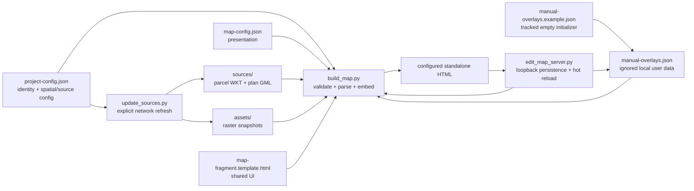

# Map Build Flow

## Boundaries

- Refresh is the only normal workflow that calls external data services.
- Build is deterministic for the checked-in configuration, snapshots, template, and the current local overlays. A missing local overlay file is initialized from the tracked empty example.
- Generated HTML is ignored because it embeds current data, rasters, and potentially private local overlays. It loads `d3-geo` from a CDN.
- The editor serves only the map directory on loopback, validates writes, persists overlays atomically, rebuilds, and signals the browser to reload.
- Direct `file://` use cannot write the repository; it uses project-namespaced browser storage and supports export.
