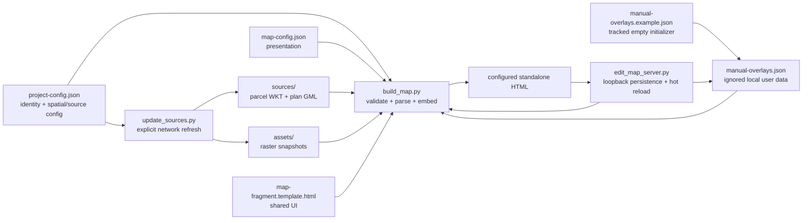

# Map Build Flow

## Status And Scope

This document describes the current runtime and data flow of the retained
Python/HTML legacy application. The replacement foundation and accepted target
boundaries are documented in
[Target Product Architecture](target-product-architecture.md).

```mermaid
flowchart LR
    PC["project-config.json\nidentity + spatial/source config"]
    VC["map-config.json\npresentation"]
    SO["sources/\nparcel WKT + plan GML"]
    RA["assets/\nraster snapshots"]
    MT["manual-overlays.example.json\ntracked empty initializer"]
    MO["manual-overlays.json\nignored local user data"]
    UP["update_sources.py\nexplicit network refresh"]
    BU["build_map.py\nvalidate + parse + embed"]
    TM["map-fragment.template.html\nshared UI"]
    HT["configured standalone HTML"]
    ED["edit_map_server.py\nloopback persistence + hot reload"]

    PC --> UP
    UP --> SO
    UP --> RA
    MT --> MO
    PC --> BU
    VC --> BU
    SO --> BU
    RA --> BU
    MO --> BU
    TM --> BU
    BU --> HT
    ED --> BU
    ED --> MO
    HT --> ED
```

## Input, Parsing, And Output

- `project-config.json` supplies build and acquisition configuration, including
  the output filename, source services, raster paths, and the spatial/source
  contract defined by the
  [Legacy Map Model](../domain/legacy-map-model.md).
- `map-config.json` supplies presentation settings only.
- `sources/` and `assets/` are checked-in evidence snapshots.
  `update-sources.sh` replaces them through explicit network calls;
  `build-map.sh` reads them but never downloads data.
- The builder accepts parcel WKT `POLYGON` and `MULTIPOLYGON`, including
  multiple rings. It targets the configured APP schema namespace and extracts
  `StrefaPlanistyczna` and `ObszarUzupelnieniaZabudowy` from planning GML.
- The builder normalizes the configured GML coordinate order to `[x, y]`.
- Complex GML holes and multi-surface semantics remain conservative and require
  visual comparison with the authoritative source.
- Generated HTML embeds configuration, parsed vectors, raster snapshots, and
  local overlays. It is ignored by Git, must be rebuilt after an input changes,
  and may contain private user notes.

## Persistence And Reload

- A missing `manual-overlays.json` is initialized from the tracked empty
  example; initialization never replaces an existing file.
- The loopback editor validates a GeoJSON-like `FeatureCollection`, writes the
  local overlay file atomically, rebuilds the map, and signals browser reload.
- Direct `file://` use cannot write the repository. New sketches remain in
  project-namespaced browser storage until exported.

## Boundaries

- Refresh is the only normal workflow that calls external data services.
- Build is deterministic for the checked-in configuration, snapshots, template,
  and current local overlays.
- The builder can target another complete project-map directory through
  `--map-dir`; sanitized verification fixtures reuse the production template in
  a temporary directory rather than carrying a divergent copy.
- Generated HTML loads `d3-geo` from a CDN; no other normal build step requires
  external services.
- The editor serves only the map directory on loopback.
