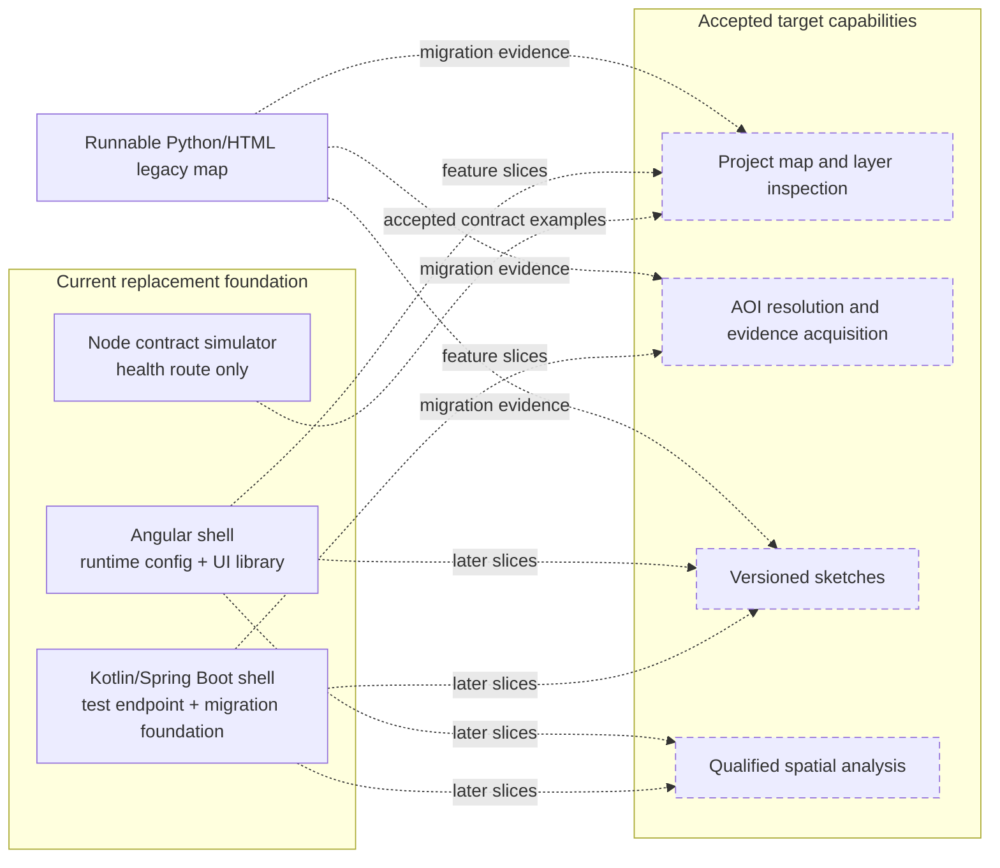
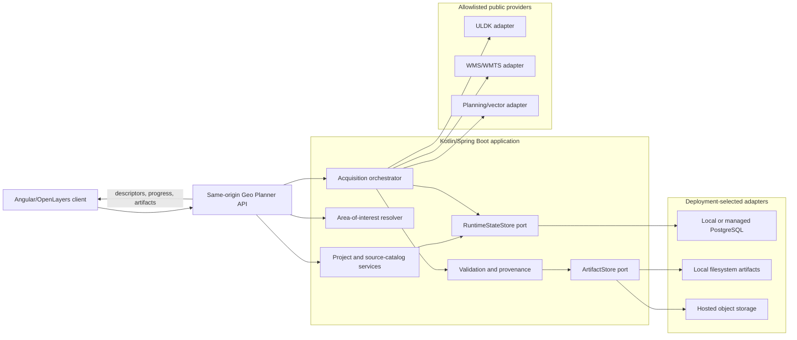

# Target Product Architecture

## Status And Scope

This document is the entry point for accepted target system boundaries. The
repository contains Angular and Kotlin/Spring Boot application foundations plus
a health-only Node contract simulator; they do not yet implement the product
capabilities below. Current legacy runtime behavior is documented in
[Map Build Flow](map-build-flow.md).

Domain concepts and invariants are owned by
[Spatial Evidence Domain](../domain/spatial-evidence.md). Provider
orchestration and artifact promotion are owned by
[Acquisition And Artifact Flow](acquisition-and-artifact-flow.md). Exact
user-visible behavior remains in the
[requirements portfolio](../requirements/index.md).

## Implementation State

The `LEGACY` and `FOUNDATION` nodes describe current repository state. Dashed
`TARGET` nodes are accepted capabilities that are not yet implemented. Dotted
arrows describe planned delivery, not runtime calls. The legacy application
remains the only working map product until the applicable requirements and
parity gates are verified.

## System Boundary

The frontend owns presentation, OpenLayers rendering, forms, and transient
interaction state. The backend owns authoritative projects and sketches,
trusted provider configuration, acquisition, validation, provenance, caching,
and export assembly.

## Frontend Technology Decision

The target client uses Angular because it matches the owner's experience and
provides coherent structure for an application expected to grow beyond one map
page. OpenLayers remains behind application-owned adapters and supplies WMS,
multiple projections, raster and vector rendering, editing, and explicit map
control.

React remained viable but did not justify defining more conventions locally.
MapLibre GL JS should be reconsidered if vector tiles replace WMS, mixed
projections, and raster evidence as the dominant workload. SvelteKit was not
selected because owner alignment and established application conventions
outweighed its component brevity. The generated HTML application remains
migration evidence, not a target frontend.

Reassess this decision if the dominant delivery model changes, a mobile-native
client becomes primary, the application proves permanently small, or
OpenLayers loses a required spatial capability.

## Backend Technology Decision

The backend uses Kotlin, Spring Boot, Spring MVC, Gradle Kotlin DSL, and Kotest.
Spring MVC matches the current blocking provider and persistence integrations.
Ktor would require more application conventions; WebFlux is not justified
without measured concurrency or streaming needs that MVC cannot handle clearly.

The application is not declared a modular monolith. Keep capability boundaries
clear, but introduce enforced domain modules only when several distinct domains
and dependency boundaries are demonstrated. Spring Security, PostGIS, a broker,
or separate workers require an accepted capability, operational owner, and
verification strategy.

PostgreSQL state and filesystem or object artifacts remain adapters behind
deployment-neutral `RuntimeStateStore` and `ArtifactStore` ports. Domain and
application services never branch on a provider or expose paths and bucket keys
as product identity. Exact storage semantics and migration safety are defined
in [Local Artifact Data Root Contract](local-data-root.md).

## Shared Contract Boundary

The same-origin HTTP boundary is versioned through OpenAPI. Transport DTOs are
separate from Kotlin domain models and Angular domain or view models. Product
contracts evolve through accepted vertical slices rather than one speculative
complete API design.

Contract discovery and generated-client workflow follow the
[Angular Engineering Guide](../guidelines/angular-engineering-guide.md#contract-discovery-and-test-doubles).
The simulator may serve accepted examples but never defines the contract.

Every contract preserves explicit validation errors, warnings, provenance,
correlation identifiers, nullability, compatibility rules, and stable identity.
UI structure never becomes a backend persistence model, and the backend never
acts as a generic remote-URL proxy.

## Persistence And Deployment Profiles

Product delivery stage and deployment profile are separate. The same accepted
slice can run locally or in a private hosted environment. A cloud deployment is
not SaaS-ready until identity, ownership, quotas, retention, cost, and
operations are accepted.

| Profile | Runtime state | Large artifacts | Additional boundary |
| --- | --- | --- | --- |
| Local development / self-hosted | PostgreSQL in a managed local container | Configurable ignored filesystem root | Backend binds to loopback during local development. |
| Hosted single-user or test | Managed PostgreSQL through the same port | Quota-controlled object storage | Same-origin routing and deployment-level authentication may precede product accounts. |
| Accounts and multi-user cloud | PostgreSQL with explicit ownership; PostGIS only for justified queries | Authorized object storage delivery | Security, quotas, retention, audit events, and signed access become product contracts. |

The first persisted slice stores project and AOI state, selected layers and
preferences, acquisition records, artifact references, sketch IDs and
revisions, imports, and schema version in PostgreSQL. Raster, export, and
temporary acquisition bytes remain outside database columns.

Local acquisition uses a bounded in-process executor. Separate workers or a
broker enter only when this no longer meets measured reliability or scaling
needs. Browser OPFS, IndexedDB, or Cache storage may hold reconstructible data,
but never authoritative projects, sketches, manifests, or acquisition records.

## Security And Reliability

- Keep provider allowlisting, request bounds, validation, and partial-failure
  behavior at the acquisition boundary.
- Never derive filesystem paths or upstream URLs directly from project input.
- Reject ambiguous coordinate order rather than guessing.
- Preserve the last valid artifact when a refresh fails or is incomplete.
- Redact secret-classified parameters and never log private sketch bodies.
- Keep source date, attribution, uncertainty, and preview-only meaning visible.
- Keep automated tests and normal builds independent of live providers.

Detailed provider and artifact safeguards are defined in
[Acquisition And Artifact Flow](acquisition-and-artifact-flow.md).

## Migration Boundaries

| Legacy area | Target |
| --- | --- |
| `project-config.json` | Versioned project, AOI, catalog, and acquisition contracts. |
| `update_sources.py` | Behavioral evidence, then Kotlin provider adapters. |
| `build_map.py` | Transition comparison/export tool, then legacy-only path. |
| Inline HTML template | Feature-by-feature Angular/OpenLayers replacement. |
| `manual-overlays.json` | Explicit import into backend-owned sketch state. |
| `sources/`, `assets/` | Configurable ignored runtime data; only intentional fixtures remain tracked. |

The prototype stays available until contract, functional, privacy, sketch, and
spatial parity are accepted for representative locations and CRS/axis-order
combinations. Migration remains feature-by-feature, and each implementation
increment receives an owner-approved project plan.
